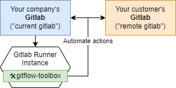

# gitflow-toolbox

A toolkit to implement Gitflows between companies.

<center>
  
</center>

## CLI Usage

### From code source
```sh
# Install dependencies
poetry install && poetry shell
# Show help
python3 main.py
# Run command
python3 main.py COMMAND [ARGS]
```

### Docker
```sh
# Show help
docker run spklabs/gitflow-toolbox
# Run a command
docker run spklabs/gitflow-toolbox COMMAND [ARGS]
```

### Environment Setup

`gitflow-toolbox` uses **environment variables**, **command** and **args** to perform actions.


Environment variables are used to define the context such as **Current gitlab** and **Remote gitlab**

#### __Current gitlab__
> Is the current gitlab where the toolbox is used from, or the Gitlab instance of your company.

When **running the toolbox in a GitlabCI job**, you have nothing to setup for this part so you can jump to __Remote gitlab__ section: the current gitlab is determined using the predefined environment variables provided by the Runner ([See predefined variables reference](https://docs.gitlab.com/ee/ci/variables/predefined_variables.html))

In a **non-GitlabCI context**, or if you want to override the values provided by the runner, you should set the following env vars

```sh
GITLAB_PROJECT_ID=123
GITLAB_URL=https://gitlab.mycompany.fr/
GITLAB_PRIVATE_TOKEN=_xxxxxxxxxxxx-Xxxx # Runner jobs have a token with a project-limited scope by default, but you can override the value if you want to extend the scope to another projects
```

#### __Remote gitlab__
> Is the target/destination gitlab, the gitlab instance of your customer or service provider

When performing actions involving another gitlab instance, you must set the following environment variables

```sh
REMOTE_GITLAB_PROJECT_ID=123
REMOTE_GITLAB_URL=https://gitlab.mycustomercompany.fr/
REMOTE_GITLAB_PRIVATE_TOKEN=_xxxxxxxxxxxx-Xxxx
```

## Commands Reference
TODO: autogenerated doc from docstring or github wiki

## GitlabCI example setup

```yml
create_remote_branch:
  stage: deliver
  image:
    name: spklabs/gitflow-toolbox
    entrypoint: ["python3", "main.py", "create-remote-branch", "alpha-delivery-1", "main"]
    variables:
      REMOTE_GITLAB_PROJECT_ID: 123
      REMOTE_GITLAB_URL: https://gitlab.mycustomercompany.fr/
      # REMOTE_GITLAB_PRIVATE_TOKEN defined in CI Variables
```

## During development

### First setup

```shell
poetry install
poetry run pre-commit install --install-hook
poetry run pre-commit install --install-hooks --hook-type commit-msg
```

### Test && Coverage

To run all tests and retrieve coverage

```shell
# Remove previous run
coverage erase

# Run test and collect coverage
coverage run

# Generate HTML report
coverage html

# Console coverage report
coverage report -m
```

or

```shell
coverage erase && coverage run && coverage html && coverage report -m
```

## VS Code

```json
{
  "python.linting.enabled": true,
  "python.linting.pylamaEnabled": true,

  "python.formatting.provider": "black",
  "python.formatting.blackArgs": [
    "--exclude",
    "((.git|.tox|migrations))",
    "--include",
    ".pyi?$",
    "--line-length",
    "120"
  ],
  "editor.formatOnSave": true
}
```
